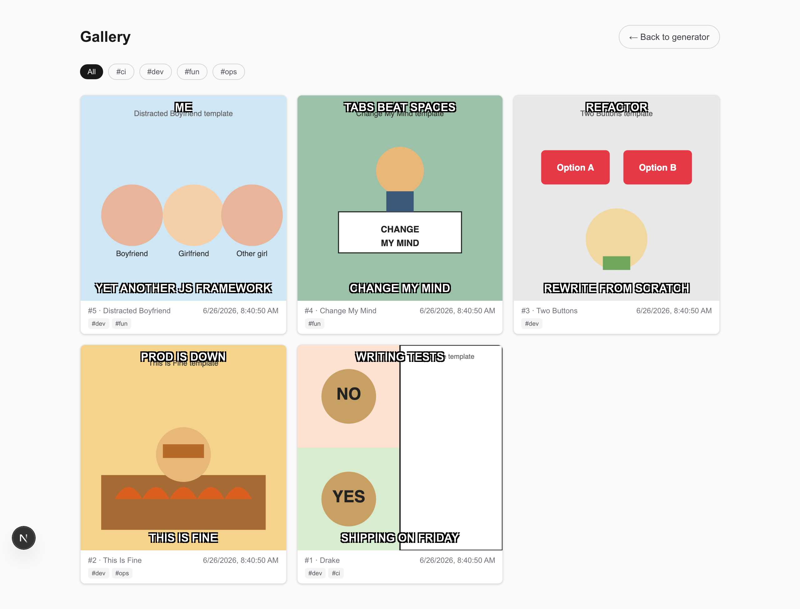
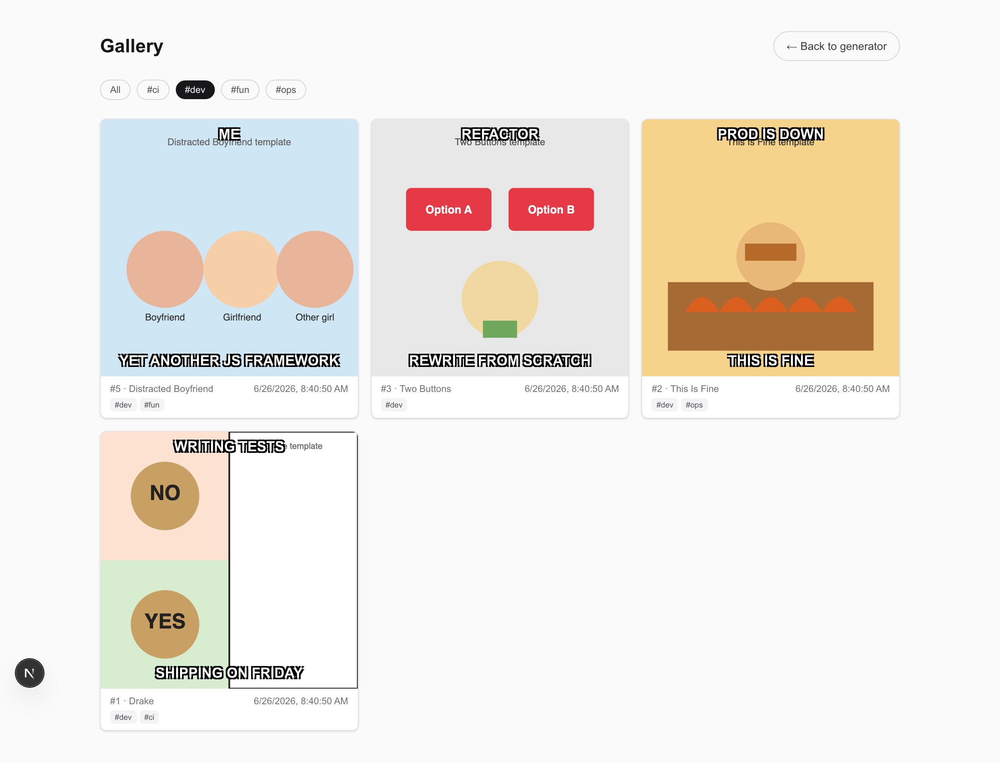

# Filtering the gallery by tag

The gallery shows every saved meme. Once you have a wall of them, the tag filter
narrows it down to one topic — `dev`, `fun`, `ops`, whatever the memes are tagged
with.

## Steps

1. Open **Gallery** from the top-right link. You see every saved meme, newest
   first, each card showing its tags as small `#chips`.

   

2. At the top of the gallery is a row of tag pills — **All** plus one pill per
   tag in use. Click a tag (for example **#dev**) to filter.
3. The grid now shows only memes carrying that tag, and the active pill is
   highlighted. Click a `#chip` on any card to jump straight to that tag, or
   click **All** to clear the filter.

   

You can also link straight to a filtered view: `…/gallery?tag=dev` opens the
gallery already filtered to `dev`.
