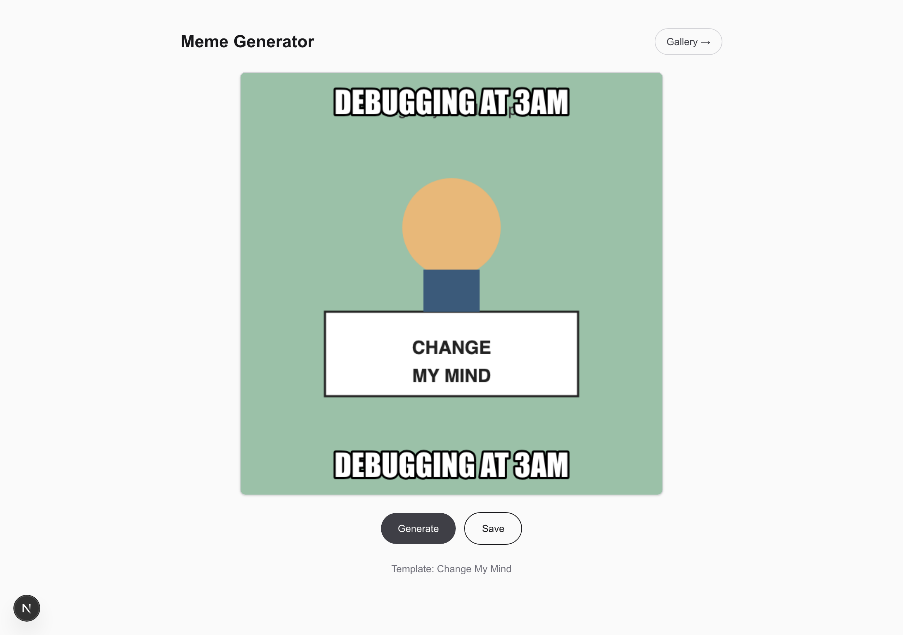

# Generating a meme

Make a meme from a random template and two captions, then save it so it shows up
in the gallery.

## Steps

1. Open the app — the **Meme Generator** page is the home screen.
2. Click **Generate**. A template loads onto the canvas with a top and bottom
   caption drawn over it, and the template's name appears below the buttons.
3. Like it? Click **Save**. A confirmation shows the new meme's number
   (e.g. *Saved as meme #6*). Click **Generate** again for a different one.

Saved memes appear in the [gallery](filtering-by-tag.md) — open it from the
**Gallery →** link in the top-right.
